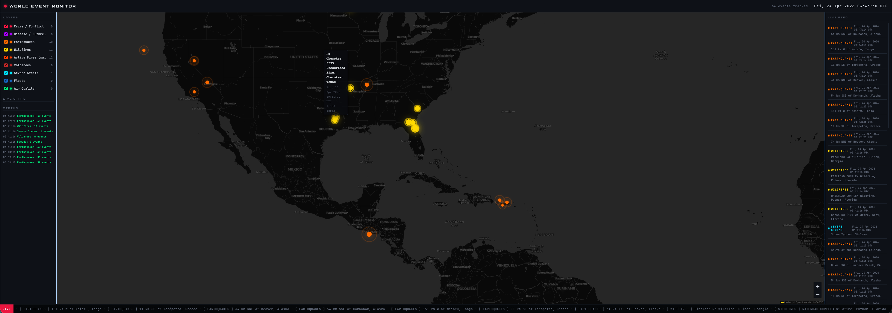

# World Event Monitor

A real-time global dashboard that plots natural disasters, conflicts, outbreaks, and environmental hazards on an interactive map. Data is pulled from public APIs and refreshed automatically — no backend, no build step, just open it in a browser.



## Features

- **Interactive world map** — Leaflet + CartoDB dark basemap, pulsing markers sized by severity
- **9 live data layers** toggleable from the control panel
- **Live feed panel** — rolling list of the 50 most recent events with color-coded tags
- **Scrolling ticker** — bottom bar streaming latest events across all layers
- **Auto-refresh** — each layer polls on its own cadence (60s for earthquakes, up to 30min for long-tail feeds)
- **Status log** — last 10 API calls with OK/FAILED indicators
- **UTC clock** in the header

## Data sources

| Layer                | Source                                    | Refresh |
| -------------------- | ----------------------------------------- | ------- |
| Earthquakes          | [USGS](https://earthquake.usgs.gov/fdsnws/event/1/) | 60s     |
| Wildfires            | [NASA EONET](https://eonet.gsfc.nasa.gov/) | 5 min   |
| Active Fires (sat)   | [NASA FIRMS](https://firms.modaps.eosdis.nasa.gov/) (VIIRS) | 10 min  |
| Volcanoes            | NASA EONET                                | 5 min   |
| Severe Storms        | NASA EONET                                | 5 min   |
| Floods               | NASA EONET                                | 5 min   |
| Crime / Conflict     | [GDELT 2.0](https://www.gdeltproject.org/) | 15 min  |
| Disease / Outbreak   | GDELT 2.0                                 | 30 min  |
| Air Quality          | [WAQI](https://aqicn.org/)                | 10 min  |

All sources are free and open. Most require no authentication; FIRMS and WAQI need a free API key (see setup below).

## Setup

### 1. Clone and configure keys

```bash
git clone https://github.com/koulumang/world-event-monitor.git
cd world-event-monitor
cp config.example.js config.js
```

Then edit `config.js` and add your keys:

- **FIRMS MAP_KEY** — register at [firms.modaps.eosdis.nasa.gov/api/map_key](https://firms.modaps.eosdis.nasa.gov/api/map_key/) (instant, no approval). Free tier is 5000 requests / 10 minutes.

`config.js` is gitignored so your keys stay out of the repo.

### 2. Run a local server

The app uses native ES modules, so it needs to be served over HTTP (opening `index.html` directly won't work).

```bash
python3 -m http.server 8000
```

or

```bash
npx serve
```

Then open [http://localhost:8000](http://localhost:8000).

## Project structure

```
.
├── index.html           # HTML scaffold + Leaflet/fonts CDN links
├── app.js               # Orchestration: layer registry, map init, render fns, feed, ticker
├── styles.css           # Dark theme, grid layout, pulse/animation keyframes
├── config.example.js    # Template for config.js (committed)
├── config.js            # Your local keys (gitignored)
└── layers/
    ├── earthquakes.js   # USGS GeoJSON
    ├── wildfires.js     # EONET wildfires
    ├── firms.js         # NASA FIRMS VIIRS CSV
    ├── volcanoes.js     # EONET volcanoes
    ├── storms.js        # EONET severe storms
    ├── floods.js        # EONET floods
    ├── gdelt.js         # GDELT events + disease queries
    └── airquality.js    # WAQI
```

Each layer module exports a `fetch*()` function that returns a normalized array of events: `{ lat, lon, title, date, ...meta }`. Adding a new source is a matter of writing a parser and registering it in the `LAYERS` array in `app.js`.

## Tech stack

- Vanilla JavaScript (ES6 modules) — no framework, no bundler
- [Leaflet](https://leafletjs.com/) 1.9.4 for the map
- CartoDB Dark tiles, OpenStreetMap attribution
- CSS Grid + custom animations

## Limitations

- Client-side only — any API key shipped to the browser is visible to users of the site. The FIRMS free tier's rate limit caps abuse, but if you deploy this publicly you should proxy sensitive keys through a serverless function.
- Not responsive — the 3-column layout assumes a wide desktop viewport.
- No marker clustering yet — dense regions (e.g. FIRMS over the Amazon in dry season) can clutter the map.

## License

MIT
